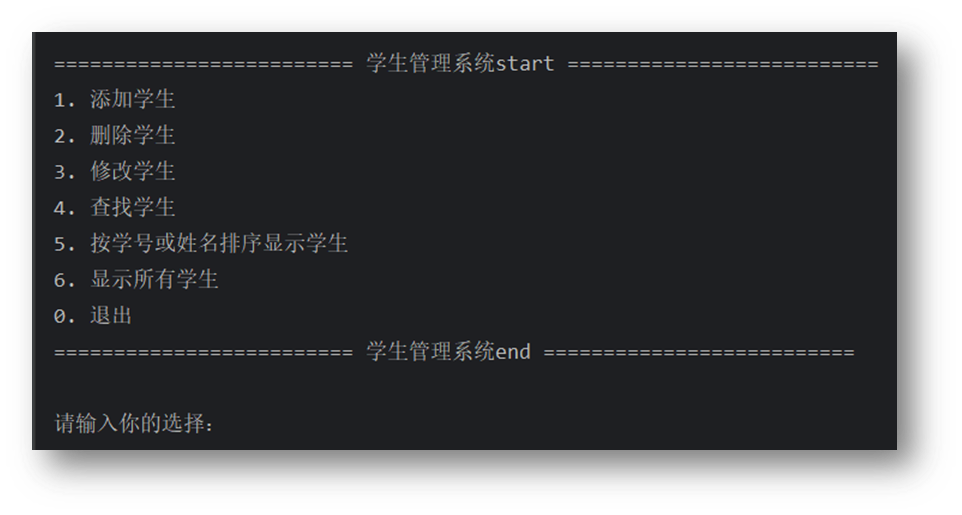
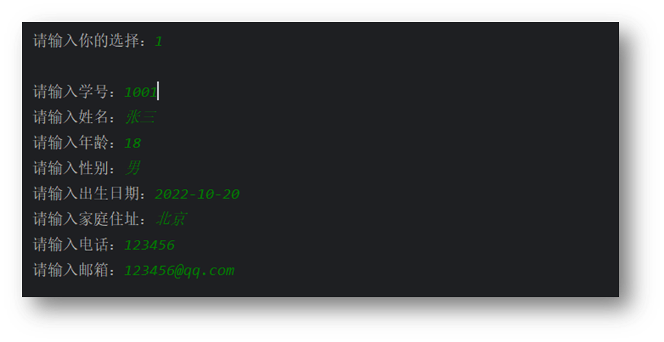
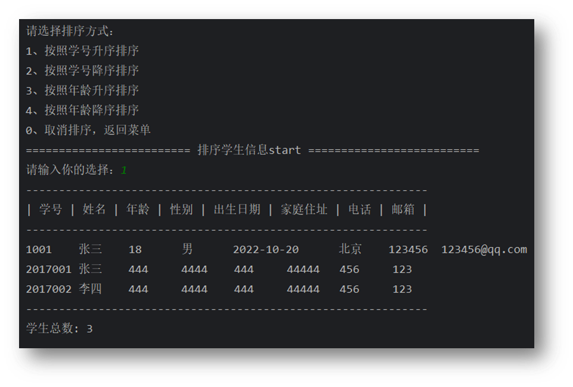
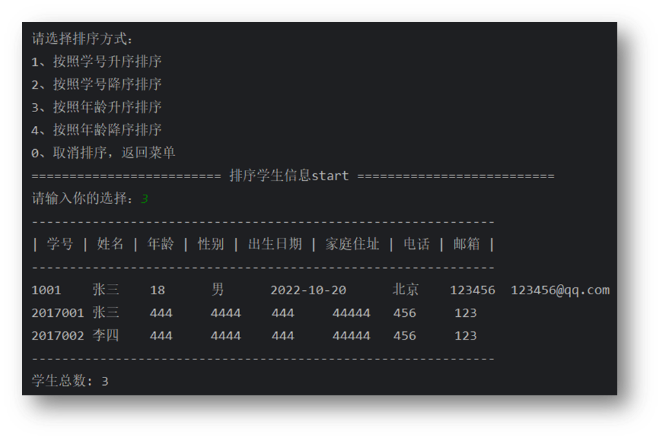

# 一、问题描述

学生信息包括:学号、姓名、年龄、性别、出生年月、地址、电话和 E-mail等。试设计一个学生信息管理程序，实现学生信息的电子化管理。要求:使用文件方式存储数据,采用链表组织学生数据。

# 二、设计思路 

- 1、添加学生的个人信息，如学号、姓名、年龄、性别、出生年月、地址、电话、 E-mail。
- 2、查询学生信息，可以根据学号或者姓名查询学生信息
- 3、删除学生信息，可以根据学号删除学生信息
- 4、修改学生信息，可以根据学号和学生来查找要修改的学生信息，然后选择修改相应的数据
- 5、排序学生信息，根据学生的学号或年龄来对应排序

# 三、数据结构定义

## 1、声明每个全局变量与结构体

`student.h` 主要用于声明一些全局遍历和结构体

```c_cpp
#define FILE_NAME "data.bin"
#define TABLE_HEAD "学号     姓名    年龄    性别    出生日期     家庭住址     电话           邮箱  "

struct Info {
    string sno;             // 学号,唯一，不可重复，每次添加学生时检查
    string name;            // 姓名
    int age;                // 年龄
    string gender;          // 性别
    string birthday;        // 出生日期
    string address;         // 家庭住址
    string phone;           // 电话
    string email;           // 邮箱
};

typedef struct S {
    struct Info info;       // 学生信息
    struct S *next;         // 指向下一个学生的指针
} Stu;

typedef struct {
    string type;            // 排序类型，如： 学号 | 年龄
    string order;           // 排序方式，如： 升序 | 降序
} Sort;
```

## 2、定义学生类

用面向对象写法创建学生类，此内容存在于`student.h`

```c_cpp
class Student {
public:
    int total;

    /**
     * 初始化，把db/student.bin文件中的学生信息读取到内存中
     * @return Stu* 返回学生信息
     */
    Stu *init();

    /**
     * 打印学生信息
     * @param Info *info  学生信息
     * @param bool show_head 是否显示表头
     * @return void
     */
    void print(Info info, bool show_head = true);

    /**
     * 查找学生
     * @param Stu *S 学生信息
     * @param string str 学号或姓名[可选,默认空]
     * @param bool showMessage 是否显示提示信息[可选,默认false]
     * @return Stu* 返回学生信息
     */
    Stu *find(Stu *S, string str = "", bool showMessage = false);

    /**
     * 添加学生
     * @param   Stu *S  学生信息
     * @param   Info *info 学生信息
     * @return  Stu* 返回最新学生信息
     */
    Stu *add(Stu *S, Info info);

    /**
     * 删除学生
     * @param   Stu *S  学生信息
     * @param   string str 学号或姓名
     * @return  Stu* 返回最新学生信息
     */
    Stu *del(Stu *S, string str);

    /**
     * 打印所有学生信息
     * @param   Stu *S  学生信息
     * @return  void
     */
    void printAll(Stu *S);

    /**
   * 修改学生信息
   * @param Stu *S 学生信息
   * @param string sno 学号
   * @return Stu * 返回学生信息
   */
    Stu *update(Stu *S, string sno);

    /**
     * 排序学生信息,可以按照学号或年龄排序
     * @param   Stu *S  学生信息
     * @param   Sort sort 排序信息 type: 排序类型，如： 学号 | 姓名 order: 排序方式，如： 升序 | 降序
     * @return  Stu* 返回最新学生信息
     */
    Stu *sort(Stu *S, Sort sort);

    /**
     * 保存文件
     * @param Stu *S 学生信息
     * @return void
     */
    void save(Stu *S);

};
```

## 3、通用方法，主要处理控制台输入

`input.cpp` 主要用于一些比较简单和重复的逻辑，如控制台输入或显示信息，以及程序的入口

```c_cpp
/**
 * 从控制台输入学生信息，用于添加学生时输入，返回输入后的内容
 * @param bool isUpdate 是否是更新学生信息，默认为false
 * @return Info
*/
Info inputInfo(bool isUpdate = false);

/**
 * 用于查找学生时输入学号或者姓名提示词，返回输入的内容
 * @param tips  提示词，默认为：学号或姓名
 * @return string
 */
string inputTips(string tips = "学号或姓名");

/**
 * 从控制台输入学生信息,用于更新时输入，返回输入后的内容
 * @param student *info 学生信息
 * @return student  返回学生信息
 */
Info inputUpdateInfo(Info info);

/**
 * 从控制台输入排序类型，用于排序时输入排序类型
 * @return  Sort
 */
Sort inputSort();

/**
*  判断学号是否重复
 *  @param Stu *S 学生信息
 *  @param string sno 学号
 *  @return bool
*/
bool isRepeat(Stu *S, char *sno);

/*
* 程序入口，显示系统菜单
 * @return void
*/
void init_menu();
```

<br/>

# 四、程序框架

1. main 函数调用 init_menu;函数显示主菜单；
2. 在 init_menu函数中按显示主菜单输入需要操作指令来调用学生类中的添加学生信息方法 add；函数显示所有学生信息函数printAll；查询学生信息函数find；删除学生信息函数del；修改学生函数update；排序显示学生信息函数sort；
3. 添加学生需要检查学号是否已经存在，检查函数isRepeat，检查到已经有了该学号，显示子菜单，选择是否继续添加或者退出添加，如果继续添加，那么将重新输入学生信息；
4. 查找学生，查找函数作为一个通用函数，可以传递参数做不同的功能，例如，不传入学号或姓名，就直接查找尾结点，如果要查找学生，那么就返回查找到的学生；
5. 删除学生，先调用查找函数，查找是否有该学生，查找到要删除的学生信息，如果有就删除，反之提示没有该学生信息；
6. 修改学生，先调用查找函数，查找是否有该学生，如果有就显示子菜单，子菜单可以选择你要修改的学生信息；
7. 排序显示，显示子菜单，输入需要排序的类型，排序成功后显示出排序后的所有学生信息，也就时调用显示所有信息函数printAll；
8. 显示所有学生，打印所有学生信息，输出到控制台；
9. 退出程序并保存信息到本地文件

<br/>

# 五、运行与调试分析

## 1、显示主菜单实现人机操作界面



<br/>

## 2、添加学生信息



## 3、显示所有学生信息按学号大小排序



## 4、显示所有学生信息按年龄大小排序

